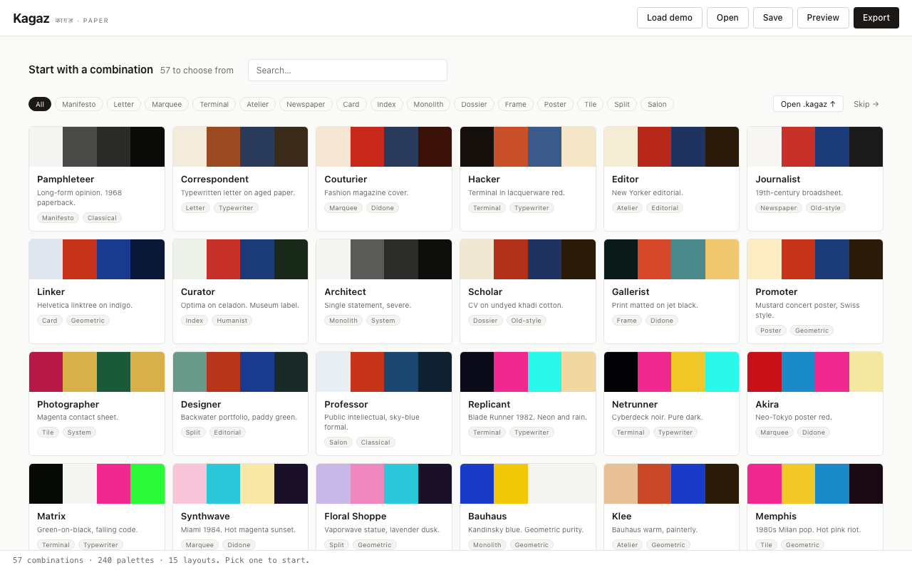
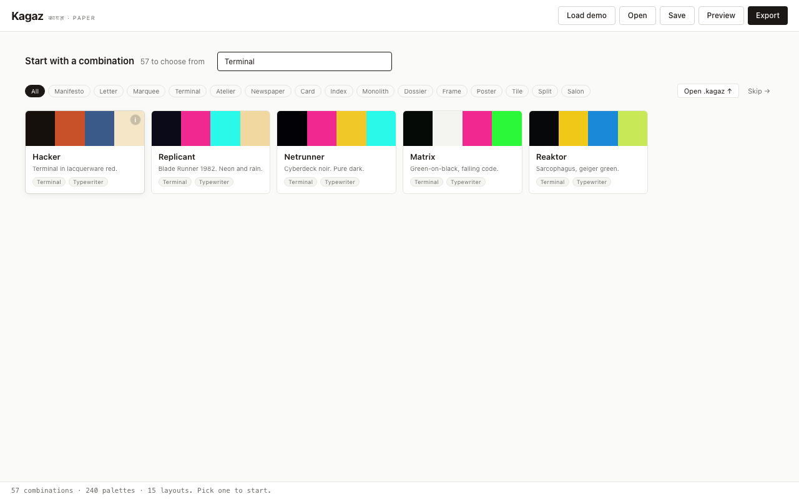
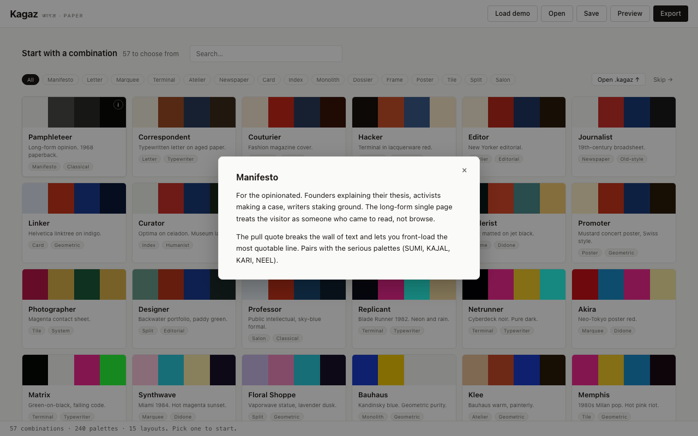
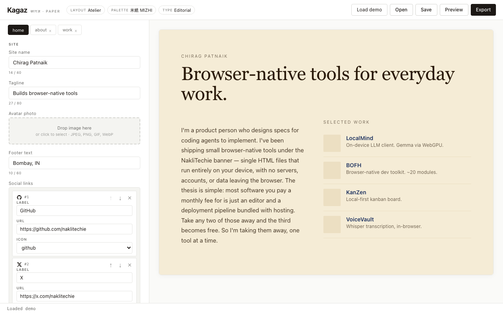
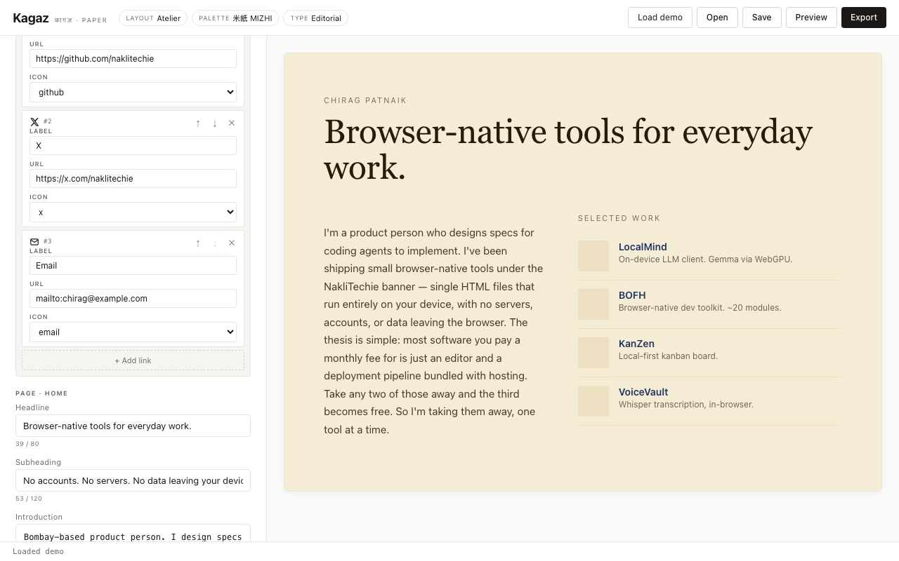
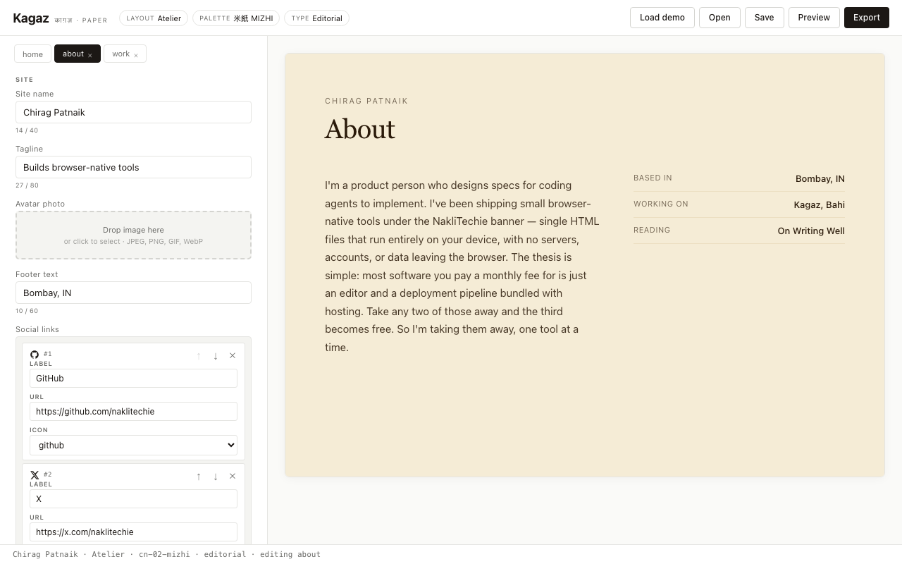
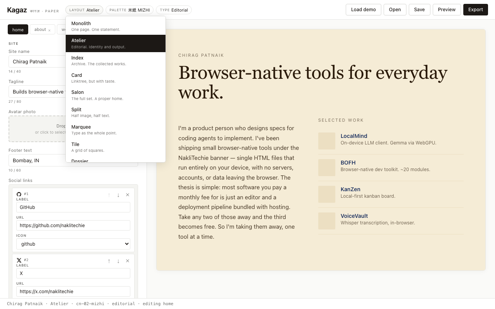
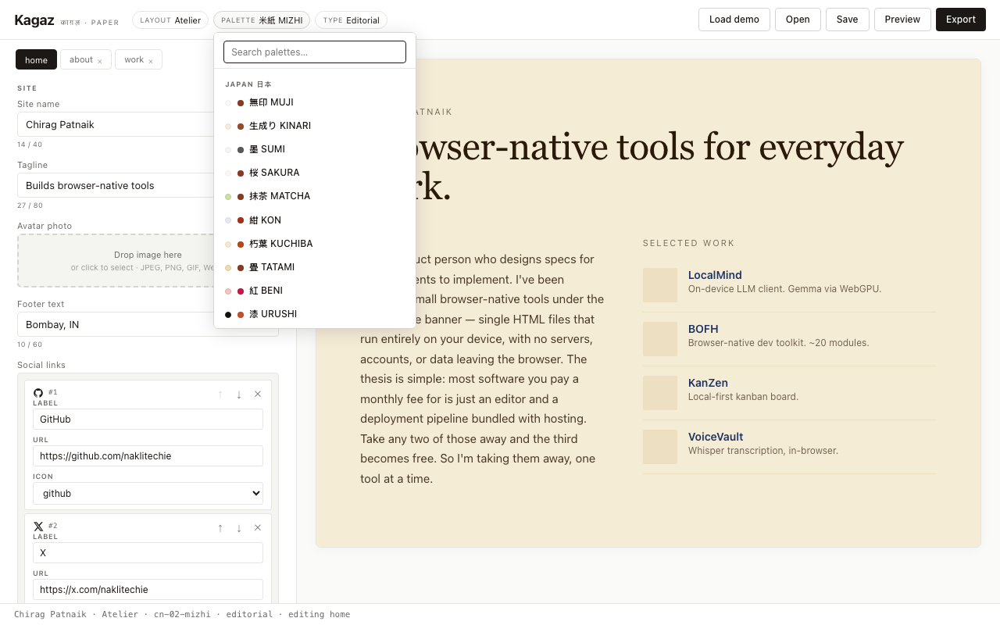
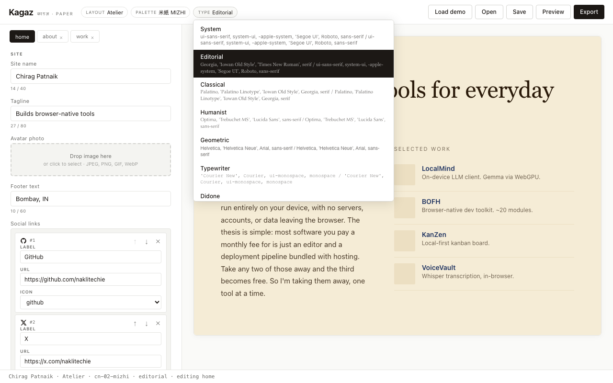
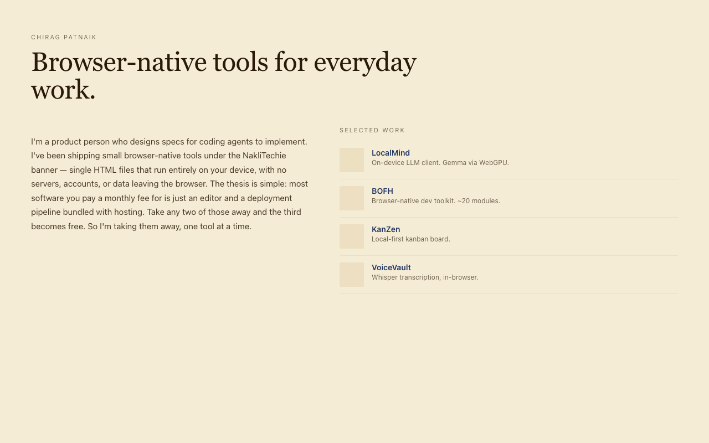

# Kagaz — Walkthrough Guide

काग़ज़ means *paper*. Kagaz is a browser-native personal site builder: one HTML file, no accounts, no servers, no data leaving your device.

This guide walks you through the full workflow — from picking a combination to exporting a deployable site.

---

## 1. The Choose screen

When you open Kagaz, you land on the **Choose screen** — a grid of 57 curated combinations, each one a (layout × colour palette × typography) starting point.



Each card shows:
- A **colour swatch** (four slots: body, brand, action, ink)
- A **name** and flavour line
- Pills for the **layout** and **typography**

### Searching and filtering

The **search box** matches against combination names and descriptions. The **layout filter pills** let you browse all combinations that use a specific layout — useful if you already know you want, say, a Terminal or a Manifesto.



### Learning about a layout

Hover over any card and an **`i` button** appears in the top corner of the swatch. Click it to read the layout's story — who it's for, what it signals, which palettes pair best with it.



Press **Escape** or click outside to close.

---

## 2. Picking a combination

Click any card to start a new project with that combination. All slots start empty — the combination sets the visual language, you fill in the words.

**Already know what you want?** Click **Skip →** in the top-right corner of the Choose screen. It drops you straight into the editor with the *Architect* default (Monolith layout, Sumi palette, System typography) — a severe single-statement page that works for almost any announcement or landing.

**Opening an existing project?** Click **Open .kagaz ↑** to load a previously saved `.kagaz` file, or use the **Open** button in the topbar at any time.

---

## 3. The editor

After picking a combination you enter the editor: a two-column layout with the **content form** on the left and the **live preview** on the right.



The topbar shows the active combination as three clickable pills — **Layout**, **Palette**, **Type** — and the **Load demo / Open / Save / Preview / Export** buttons.

---

## 4. Filling in content

The form is split into two sections:

### Site — fields that appear on every page

These are your identity: name, tagline, avatar, footer text, and social links. Fill them once; every page inherits them.


### Page — fields for the current page

Scroll down past the Site section to reach the page-specific fields. The fields depend on the active layout and page type.



**Field types:**
- **Text** — single line, with a soft character-count hint
- **Long text** — multi-line markdown textarea (supports `**bold**`, `*italic*`, `[links](url)`, `- lists`)
- **Image** — drop a JPEG/PNG/GIF/WebP onto the drop zone, or click to select. Kagaz compresses it to max 1200px JPEG automatically.
- **List** — repeatable items (e.g. work projects, writing posts). Each item has its own sub-fields. Use the arrow buttons to reorder; paste from a spreadsheet column to bulk-add.
- **Links** — social links or call-to-action buttons. Icons are auto-detected from the URL (GitHub, Instagram, X, LinkedIn, and 11 others).

---

## 5. Switching pages

Layouts that support multiple pages show **page tabs** across the top of the form. Click a tab to switch; the preview updates immediately.



Click **»** (the add button) to add a page from the list of types the current layout supports. Click the **×** on a tab to remove that page. You can have up to 5 pages.

---

## 6. Changing layout, palette, or typography

You're never locked in. Click any of the three pills in the topbar to open the axis picker and swap that dimension without losing your content.

### Layout picker

Lists all 15 layouts. Switching layout is non-destructive — content for pages the new layout doesn't support is kept in memory and restored if you switch back.



### Palette picker

240 palettes across 22 cultural families. Search by name or browse by family.



### Typography picker

8 pairings — System, Editorial, Classical, Humanist, Geometric, Typewriter, Didone, Old-style. All web-safe and system fonts; zero external requests.



The preview updates live as you browse.

---

## 7. Saving your work

### Autosave

Kagaz autosaves your text content to `localStorage` every 30 seconds (images are not included). If you close the tab and reopen Kagaz, a toast will offer to restore your last session.

### Save as .kagaz

Click **Save** to download a `.kagaz` file — a zip containing `project.json` and any images you added. Keep this file on your disk; it's your editable source.

The `.kagaz` format is open: it's just a zip. You can unzip it, read `project.json` by hand, version-control it, or sync it yourself.

---

## 8. Previewing the exported site

Click **Preview** to open a new tab showing exactly what the exported site will look like — rendered with your current palette, typography, and content, with no editor chrome.



The preview page is self-contained static HTML. You can also click **Export** to download a zip of the full deployable site.

---

## 9. Exporting and deploying

Click **Export** to download a zip containing:

```
your-site-name.zip
├── index.html          (and about.html, work.html, etc. for multi-page layouts)
├── assets/             (only the images you actually used)
├── favicon.png         (auto-generated from your avatar, if you set one)
└── source.kagaz        (your editable source file, embedded alongside)
```

The HTML files are pure static — no JavaScript, no tracking, no third-party requests. Drop the unzipped folder into:

- **Cloudflare Pages** — drag the folder onto the Pages dashboard
- **Netlify** — drag the folder onto the Netlify drop zone
- **GitHub Pages** — push the files to a `gh-pages` branch
- **Any static host** — it's just HTML + a folder of images

The `source.kagaz` file inside the zip is a copy of your editable project. If you ever lose your local `.kagaz` file, you can download your own deployed site, unzip it, and find `source.kagaz` to re-edit.

---

## Tips

- **The combination is just a starting point.** Swap the palette after picking a layout-based combination; swap the layout after you like the palette. The pickers are free to explore.
- **Soft character limits are suggestions, not blocks.** The form shows a count when you approach the recommended length. Going over is fine; going well over makes the layout work harder.
- **Images are compressed on drop.** You don't need to pre-resize. Kagaz re-encodes to max 1200px JPEG at 0.85 quality — enough for any web layout, small enough to travel in the `.kagaz` file.
- **The exported site contains the source.** You can't lose your project as long as your site is live.
